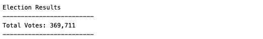
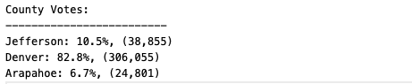

# Overview of Election_Analysis
The overview of the Election Analysis at US Congressional Rate is to find the election results based  on total votes, largest votes and percentage  for the county. Analysis is performed by using the given .csv file of data. Data analysis for the project was performed using Python 3.9.2 version and Visual code editor.

# Election-Audit Results: 
 ## The analysis the election show that:

- ### There were 369,711 votes cast in the Congressional election.
    
-  ### The candidate Results were:
     
- ### Total County Votes are:
    
- ### Largest County Turnout is:
    
- ### Winning Results are:
    
### Diana DeGetter who recieved 272,892 votes with 73.8% was winner of the Election Result.

# Election-Audit Summary: 

This script can be used in the future to perform any elections by refactoring the code with below modifications:

- We can write a common utility which reads .csv file taking the file path as input parameter.
-  We can do further analysis using data attributes such as age, gender, population to have further clarification on voting results. 
-  We just need to ensure the code is giving desired results by doing proper testing analysis.

